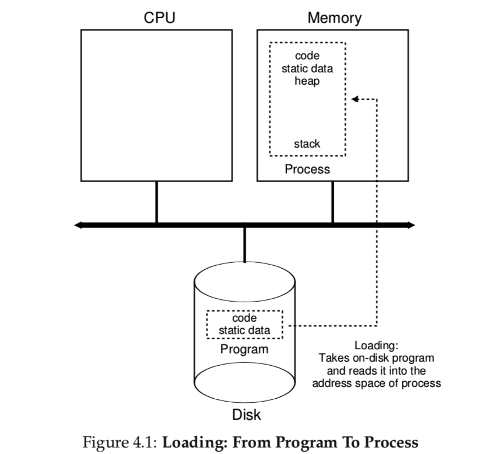
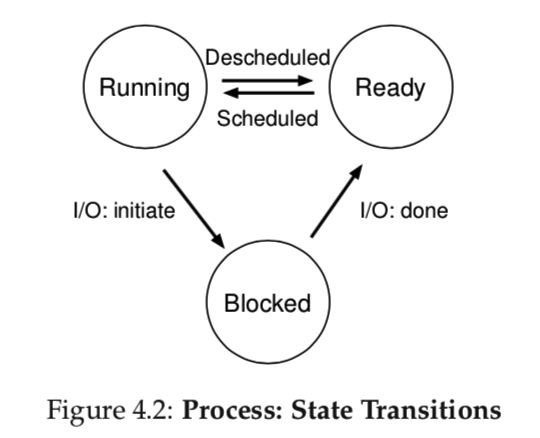

## 进程

本篇中，我们将讨论操作系统提供给用户的最基础的抽象之一：进程。进程的定义很简单：一个**运行中的程序**。程序本身是一种静态事物，仅仅存在于磁盘之上，是一堆指令或静态数据的集合，等待着被加载和运行。是操作系统将这些静态的字节组织加载并运行，使程序为我们所用。

我们常常希望同时运行多个程序，比如当你使用笔记本电脑时会同时打开浏览器、收发邮件、玩游戏、听音乐等，实际上，一个典型的操作系统看上去是在同时运行数十甚至上百个进程，这种特性使系统便于使用，因为用户从不需要关心是否有可用的CPU，仅仅需要运行和使用程序。因此我们的挑战是：

> <center>问题的关键：</center>
>
> 如何提供多个CPU的假象：
>
> 尽管实际上只有有限的物理CPU可用，但操作系统如何做到CPU是"无穷无尽"的假象呢？

操作系统通过CPU的**虚拟化**技术实现这种假象。操作系统通过运行一个程序，然后停止随后切换运行另外一个程序，如此反复，使用户认为有多个CPU存在，但实际上仅仅有一个物理CPU。分时技术是实现虚拟化的基础，分时使用户能并发运行多个程序，这样做的代价是性能损失：如果CPU被共享，每一个程序都会运行的相对较慢。

为了更好的实现虚拟化，操作系统需要底层机制和上层策略的配合。底层机制是指实现了一些底层基础功能的方法或协议，比如我们将要讨论的如何实现**上下文切换**，就是能够使CPU具有停止运行当前程序并开启另外一个进程的能力，这种分时的机制被所有的现代操作系统所应用。

在底层机制之上操作系统还有自己的**策略**。策略是操作系统做决策的算法。比如有一系列将要使用CPU的程序，操作系统应该先运行哪一个呢？**调度策略**将给出答案，比如结合一些历史信息（例如哪些程序在前一分钟已经占用CPU较多)、负载信息（哪些类型的程序在运行）以及性能因素（当前系统是追求实时响应性能还是吞吐量）来进行决策。

> 时间分享（空间分享）
>
> 分时是实现操作系统共享资源最基本的技术。通过轮流使用硬件资源（如CPU、网络连接等）可以使有限的资源被多个程序使用。与时间分享相对应的是空间分享，资源从空间角度被分成多份被多个程序使用。比如磁盘就是一种典型的空间分享型资源，一个块区一般只属于一个文件，在该文件被删除之前并不会分配给其他文件。

### 4.1 抽象：进程

操作系统将正在运行的程序抽象为进程。在任何时刻，我们都可以通过对程序在运行过程中访问或影响的操作系统不同部分进行总结来描述一个进程。

为了理解进程的构成，我们必须理解它的硬件状态：程序在运行时可以读取或更新哪些内容？在任意给定时刻，硬件的哪些方面对程序运行起到重要作用？

对于进程，其硬件状态的典型组成之一就是它的**内存**。内存中存有指令以及程序读写的数据。因此进程可以组织的内存部分（地址空间）是其重要组成。

**寄存器**也是进程硬件状态的组成，许多指令会主动读取和更新寄存器，因此寄存器的重要性不言而喻。

有一些特殊的寄存器需要注意，比如**程序计数器**（PC,有时又称指令指针IP）可以告诉我们程序当前执行的指令是哪一条；类似的还有栈指针以及与其相关的桢指针寄存器可以用来传递和存储函数参数、局部变量以及返回地址等。

最后，程序也常需访问持久化存储设备。因此I/O信息中会包含当前进程已打开的文件清单。

> 区分策略和机制：
>
> 在操作系统中，一个典型的设计模式是区分上层策略和底层机制。你可以认为底层机制是解决了操作系统中的how问题（如何实现），比如操作系统如何实现上下文切换？而上层策略是解决了which问题（选择哪一个），比如操作系统当前需要运行哪一个进程。区分二者能够使人更容易的转变策略而无需重新考虑底层原理，是一种模块化的思想以及通用的软件设计准则。

### 4.2 有关进程的API

在这部分不具体讨论真实进程的API，先给出操作系统中有关进程的一些必要接口：

- 创建：操作系统必须具有创建新进程的方法。当你在命令行输入相关命令或双击一个应用图标，操作系统会创建运行新应用的进程。
- 销毁：除去创建，操作系统还需具有销毁进程的接口。当然一些进程运行结束后会自动退出，但有时用户需要主动终止进程，因此销毁进程的接口很必要。
- 等待：有时需要等待进程运行结束。
- 其他控制：除去主动杀死进程或等待进程结束，有时需要一些特殊的控制方法，比如需要暂停线程一段时间后再恢复运行。
- 获取状态：有时也需要获取当前进程的状态，比如运行时长以及进程当前所处状态。



### 4.3 进程创建：一点细节

我们需要明白程序是如何转换成进程的，操作系统如何让启动和运行一个程序？进程创建的细节有哪些？

第一，操作系统需要将程序的代码以及静态数据（如已初始化的变量）加载进内存，即进程的地址空间。程序最初是以可执行文件的格式存在于磁盘或固态硬盘上，因此加载代码和静态数据的过程需要操作系统从磁盘读取字节并输入内存。

在早期或简单的操作系统中，加载过程上一次性且完全的（在程序真正运行前将所有数据全部加载）；现代操作系统中，加载是懒加载，即按需加载，且仅加载需要的部分。为了更好的理解懒加载，需要理解**分页**和**交换**机制，后续在内存虚拟化部分将会讨论。现在仅需记住在运行任何程序前操作系统必须要有加载这一过程。

代码和静态数据加载完成后，在真正运行程序前操作系统还需要一点准备工作。首先需要为程序分配内存作为运行时栈，比如c程序使用栈存储局部变量，函数参数以及返回地址。操作系统在初始化栈时也可能会携带参数，比如main函数中的argc参数以及argv数组。

操作系统也会分配一部分内存作为程序的堆空间。在c程序中，堆是用来动态分配额外需要的空间的。程序通过调用malloc()请求空间以及free()释放空间。堆的实现需要一些特殊的数据结构，如链表、哈希表或树等。堆的大小会随着程序运行时请求malloc()次数的增加而增加。

操作系统也会做一些其他有关I/O的初始化工作，比如在UNIX系统中，每个进程都默认打开三个文件描述符，分别是标准输入、标准输出以及标准错误输出，这些文件描述符使程序能够从终端读取输入以及向终端输出内容，后续在持久化部分将会进一步讨论。

经过一系列初始化工作：加载代码和静态数据进入内存、创建及初始化栈、进行I/O相关的设置，程序终于做好了运行的准备，终于只差最后一步：从程序的入口开始执行，即main()函数，至此操作系统将cpu的控制权转移至新创建的进程，程序开始运行。

### 4.4 进程的状态

下面来看看在给定一个时刻，一个进程可能会具有的状态。从简单的角度，进程在某时刻可能会处于如下三个状态之一（早期的操作系统也的确只有这三个状态，现代操作系统基于此有所拓展）。

- 运行状态：进程在处理器上执行指令。
- 就绪状态：进程做好了运行的准备，但处理器在当前时刻选择不运行它。
- 阻塞状态：在阻塞状态，只有一些事件触发后才能使进程进入就绪状态，比如进程发起I/O请求时会让出cpu，自身进入阻塞状态。

用状态机表示如下图所示，进程可以在操作系统的调度下在就绪和运行态间转换，进程在阻塞后当一些事件触发时可以变为就绪状态，以及当前操作系统的调度策略，有可能会立即进入运行状态。

### 4.5 数据结构

操作系统自身就是一个程序，它具有一些关键的数据结构以储存信息。比如为了跟踪进程的状态，操作系统会存有一张就绪状态的进程表，还会记录正在运行状态的进程信息。操作系统也需要记下阻塞进程的信息，以便IO操作完成后能够顺利唤醒相关进程。

```c
// the registers xv6 will save and restore
// to stop and subsequently restart a process 
struct context {
  int eip;
  int esp;
  int ebx;
  int ecx;
  int edx;
  int esi;
  int edi;
  int ebp;
};
// the different states a process can be in 
enum proc_state { UNUSED, EMBRYO, SLEEPING,
RUNNABLE, RUNNING, ZOMBIE };
// the information xv6 tracks about each process // including its register context and state 
struct proc {
char *mem;// Start of process memory 
uint sz;// Size of process memory
char *kstack;// Bottom of kernel stack 
// for this process
enum proc_state state; // Process state
int pid;// Process ID
struct proc *parent;// Parent process
void *chan;// If non-zero, sleeping on chan
int killed; // If non-zero, have been killed 
struct file *ofile[NOFILE]; // Open files
struct inode *cwd;// Current directory
struct context context; // Switch here to run process
struct trapframe *tf; // Trap frame for the
};                 // current interrupt

图4.3 xv6系统进程结构
```

图4.3展示了xv6内核的进程结构，真实的系统，如Linux，MacOS，Windows等具有类似的结构，但会更复杂。

进程的结构中，对于停止的进程，需要将寄存器上下文保存到内存中，恢复寄存器中的这些数据可以将进程恢复到停止之前到运行状态，即上下文切换。

从图4.3还可以看出进程除了前述的运行、就绪以及阻塞状态外也具有一些其他的状态。比如进程再最初创建时可能处于initial态，进程退出还未被清理时会处于final态（unix系统中也成为zombie僵尸态）。final态的一个好处是可以让其他进程（多是该进程的父进程）判断当前进程是否运行成功（unix系统中程序运行成功通常会返回0，有异常时会返回非0值），当当前进程运行成功时，父进程会进行一次最终调用（如wait() ），等待子进程完全结束，即让操作系统清理子进程相关资源并释放。

> 数据结构—进程表
>
> 操作系统中具有许多重要的数据结构，进程表即属之一。它很普通，但对于操作系统来说要想具有运行多进程的能力，进程表必不可少。有时人们也称存储进程信息的结构为进程控制块（PCB），这仅仅是对进程表的一种花哨叫法。

### 4.6总结

我们已经简单介绍了操作系统最基础的抽象：进程。进程很简单，可以看作是运行中的程序，持有这种观点后，我们还需要关注一些重要细节：实现进程的底层机制以及调度进程的上层策略，把二者融合起来，我们会逐渐理解操作系统是如何实现cpu虚拟化的。