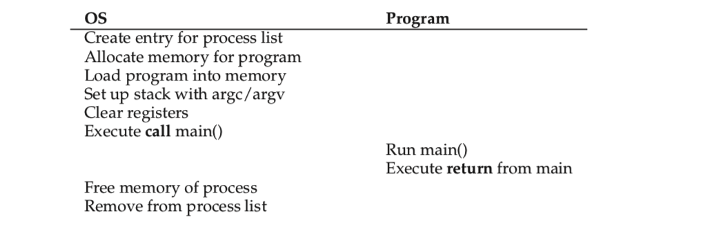

## 6 机制:受限直接运行

为了实现CPU的虚拟化，操作系统需要将CPU分享给多个任务，并使它们看起来像是在同时运行，基本思想很简单：运行一个进程一小段时间然后切换到另一个昵称，即分时策略。

但同样存在一些挑战，第一个就是性能：我们如何在不给系统增加过多额外开销的情况下实现虚拟化？第二是可控性：我们如何在持有CPU控制权的情况下更有效率的运行程序？对操作系统来说可控性很重要，因为它影响资源的分配，如果没有可控性，程序或永无休止的运行并耗尽资源，或访问其不应访问的数据。

> 如何在保证可控性的情况下更高效地虚拟化
>
> 硬件和操作系统需要同时支持。操作系统通常需要借助硬件支持更有效率的完成工作。

### 6.1 基础：受限直接运行

为了使程序尽可能快地运行，操作系统开发人员提出了一种技术，我们称之为**受限直接运行**。直接运行的意思很简单，就是直接在CPU上执行程序，如表6.1所示

> 表6.1 直接执行的大致流程（不加限制）

看起来很简单不是吗？但是对CPU虚拟化的诉求来说还存在一些问题，首先如何保证程序不做一些我们不希望的事？第二，操作系统如何停止当前程序并切换到另一个进程，也就是如何实现分时？

因为，操作系统如果不在限制的环境下运行程序将对一切失去控制，那样的话操作系统和一个库就没什么区别了，因此为了实现CPU虚拟化，必须限制程序的直接执行。

### 6.2 问题#1：特权级操作

一个进程如果想执行一些敏感，需要特权的操作该怎么办呢？比如发起I/O请求，或访问更多的系统资源，比如CPU或内存。

> 一个进程需要具有执行特权操作的能力，但不能赋予它控制全部系统的能力。操作系统和硬件该如何配合实现这一效果？

> 硬件通过提供不同模式的运行来支持系统。在用户态模式，应用不能访问全部的硬件资源，在内核态模式，系统可以访问全部的硬件资源。一些特殊的指令可以使操作系统陷入内核态并且能够从内核态返回到用户态，并且还有指令能够使硬件从系统处得知陷入表在内存中所处的位置。

一种简单的方式是让进程在IO相关的操作能够为所欲为。但是这种方式很不安全，缺少了文件的权限控制。

因此一种新的处理模式被引入，即用户态模式，在用户态执行的代码行为受到限制，比如进程在用户态下无法处理I/O请求，否则会引起异常，然后被操作系统干掉。

与用户态模式相对应的是内核态模式，即内核运行的环境，该模式下代码可以执行任何操作，包括一些特权操作。

还有一个问题是如果用户想执行特权级操作怎么办呢？为了实现这一功能，实际上几乎所有的硬件都支持用户程序执行系统调用。系统调用允许内核向用户程序暴露某些关键功能，比如访问文件系统，创建或销毁进程，与其他进程通信以及分配内存空间等。大多数操作系统提供百余条系统调用（参见POSIX标准）早期的UNIX系统提供约20条。

为了执行系统调用，程序必须执行一条特殊的指令，称为陷入。该条指令可以进入内核态，并拥有内核特权，一旦陷入内核，系统可以执行一些特权级操作从而完成主调进程的需求，当相关操作完成后，系统执行陷入返回指令，从而使系统返回用户态并降低特权级。

硬件必须存储足够的调用方寄存器状态从而保证其能够从陷入中正确返回。比如在x86系统中，处理器会将程序计数器，标识位寄存器以及一些其他寄存器推入相应进程所属的内核栈，在从陷入返回到用户态时会将这些值弹出使进程上下文恢复到陷入之前的状态。不同硬件系统可能实现细节不同，但基本思路是一致的。

> 为什么系统调用看起来像是过程调用？
>
> 你可能会疑惑为何系统调用，比如read() write()看起来和C语言中典型的过程调用很像？也就是说，如果看起来和过程调用一样，那操作系统如何区分系统调用和过程调用并完成其相应的功能？答案很简单：它是一个过程调用，但在这个过程内部隐藏着大名鼎鼎的陷入指令。比如在调用open()时，实际上先是调用C语言的库函数，在库函数中，将参数和系统调用号根据约定存储在特定的栈和寄存器中，随后调用陷入指令，陷入指令执行完毕后，库函数还能将返回值解析出来并将控制权返回给发起系统调用的进程，在C库中发起系统调用的代码是汇编完成的，而我们在发起系统调用时不需要自己写汇编，这是因为库函数已经帮你实现了。

还有一个问题是陷入时如何知道应该运行系统中的哪段代码？显然，发起调用的进程不能指定一个地址以供跳转(像发起过程调用那样)，这样做会使程序能够访问内核中的任何位置，这是不安全的，很容易被利用对系统发起攻击，因此系统必须能够控制在陷入时执行的代码。

内核通过在启动时初始化一张陷入表来实现控制。系统在启动时处于内核态，因此可以随意设置硬件。系统做的第一件事时告诉硬件当某些事件发生时应该运行何种代码去处理，比如硬盘中断，键盘中断，以及系统调用。系统告诉硬件这些陷入处理程序所在的位置，一旦硬件得知这些程序所在的位置便会将其记录在表中直到下次启动，因此硬件在系统调用或特定事件发生时知道去哪里执行相应的指令。

同样，告诉硬件陷入表的位置这一功能同样是一种很强大的能力，也是一个特权级指令，在用户态模式硬件不会允许你这么做，如果你能安装自己的陷入指令表，那就相当于控制了整个机器。

> 表6.2 受限直接运行的流程

表6.2中的时间线（从上至下时间增加）概括了从启动到程序执行系统调用并返回的流程。我们假设每个进程都有各自的内核栈，从而寄存器状态可以在陷入时保存，并在返回时恢复。

受限直接运行的流程主要分为两部分。第一，启动时内核初始化陷入表，CPU记下其位置用于后续使用。内核通过特权级指令实现（所有特权级指令均加粗）。

第二部分在程序运行时，内核在陷入返回之前做了一系列工作（进程表中分配节点，分配内存等），随后切换到用户态执行程序，当程序需要系统调用时又会通过陷入进入内核态，系统调用处理完毕后会返回，这其中包含了状态的保存和恢复。

### 6.3 问题#2：在进程间切换

在进程间切换听上去很简单，只需要系统暂停一个进程并开始另外一个就可以了。问题在于，当一个进程运行在CPU时，意味着此时操作系统是处于未运行状态的，既然操作系统没有在运行，那又如何让系统去执行切换操作呢，听上去是个哲学问题，但这个问题实际确实存在：当系统没在CPU上运行时如何让其采取操作。

> 问题的关键：如何重新获得CPU控制权
>
> 如何让操作系统重得CPU使用权，以便其进行进程切换？

#### 协作方式：等待系统调用

以前一些系统使用的方法是协作式，即系统信任进程会正常运行，进程如果需要CPU时间较长会周期性低向系统让出CPU以便系统调度其他任务。

但一个"友好"但进程如何让出CPU呢？大多数进程通过系统调用把CPU控制权移交给系统，比如文件操作、与其他机器通信、创建进程等，这类系统通常还包含一条特殊的系统调用，该指令的功能就仅仅是让出CPU。

> 处理不正常的应用
>
> 操作系统需要处理异常，通常简单粗暴的方法是直接终止，不然对于恶意行为别无他法。

应用程序还会在非法运行时转移控制权，比如除0或访问无权限的内存。

因此在这种协作方式中，只有系统调用或异常才能使操作系统重获CPU控制权，这种方式有什么不好的地方么？当然有，比如应用进程进入不做系统调用的无限循环时，操作系统将束手无策。

#### 非协作方式：操作系统掌控一切

在协作方式中，如果程序进入死循环，唯一的方式是重启机器，因此又回到原先的问题：操作系统如何重获CPU控制权？

答案很简单：通过时钟中断。计算机内部有一种时钟器件可以周期性地发起中断，预设的中断处理程序可以终止用户进程，使操作系统重新获得CPU控制权，从而进行任意调度。

如同系统调用一样，操作系统同样需要告知硬件当时钟中断发生时去哪里执行代码，在操作系统启动时进行了相关设置；第二，在启动时，系统需要启动时钟，这是一条特权指令，操作系统同样可以关闭时钟，在随后理解并发时会详细讨论。

在中断发生时，硬件需要保存程序的运行状态以便程序能够从中断后正确返回。这和系统调用时保存寄存器状态的操作是很类似的。

#### 保存和恢复上下文

现在操作系统重获CPU控制权的问题解决了，不管是协作式还是非协作式，新的问题产生了：是去继续运行当前程序还是切换到一个不同的程序？操作系统通过调度器进行调度，在后续会进行讨论。

如果决定切换到另一个程序，那操作系统需要进行一系列底层操作，我们称之为上下文切换。上下文切换的概念很简单:操作系统需要做的就保存当前运行程序的寄存器值到(到内核栈)和恢复待运行程序的寄存器的值(从内核栈)。

为了保存当前进程的上下文，操作系统需要执行一些底层汇编代码来保存通用寄存器，程序计数器以及内核栈指针等，随后恢复待运行进程的相关上下文信息。通过栈的切换，内核在当前进程的上下文中调用切换代码并返回待运行进程的上下文。当系统从陷入中返回后，待运行进程就成了实际执行的进程，上下文切换也就完成。

表6.3是上下文切换的完整流程。

注意到上述流程中有两种寄存器的存储和恢复。第一是时钟中断发生时，当前进程的用户寄存器状态被硬件隐式保存到进程对应的内核栈中；第二是当系统准备把进程A切换到进程B时，内核寄存器状态被软件（如操作系统）保存到内存中（进程对应的进程数据结构），与此同时从内存中恢复B的上下文。

xv6的上下文切换代码如6.1所示。（此处存疑，**old似乎应为old，IP似乎指的就是old和new指针，汇编指令和栈指针的相关概念需要熟悉，栈地址向底部增长，栈顶为esp，地址较小，esp+4为第一个参数地址，esp+8为第二个，注意pop指令隐含了将esp+4后再赋予esp的语义)

### 6.4 对于并发的担心？

还存在一些问题：当系统调用时发生时钟中断怎么办呢？当处理一个中断时发生另一个中断怎么办呢？内核会很难处理么？

操作系统的确需要关心这些情况发生时该如何处理，即并发问题。后续将详细讨论。这里简单提一下，操作系统能做的简单的一个操作是在处理中断时终止新中断的发生，这样能保证处理中断时不会丢失CPU控制权，但必须小心，长时间终止中断可能会丢失一些中断。此外操作系统还发展出一套较为复杂的锁机制，用以保护并发访问时的数据结构不受破坏，在多处理器环境下尤其有效，当然这套机制会很复杂，并且会带来一些有趣和难以察觉的问题。

> 上下文切换耗时多少？
>
> 你可能会有这样一个问题：一次上下文切换或者系统调用耗时多少？一个**lmbench**的工具可以测量相关性能。
>
> 随着处理器的发展，结果也不断提升：1996年在LINUX 1.3.37上使用200MHz P6 CPU测试得到系统调用约需4微秒（百万分之一秒），上下文切换需要6微秒；现代操作系统在 2- or 3-GHz 的CPU上取得了亚微秒的结果。
>
> 必须指出的是不是所有的系统行为都依赖于CPU性能。如同Ousterhout观察的那样，许多系统行为是依赖于内存的，而内存带宽的发展并未像CPU这般快速，因此最先进的CPU未必能带来最好的系统体验，要根据实际的工作需求去选购电脑。

### 6.5 总结

我们已经阐述了实现CPU虚拟化的一些底层核心机制，即受限直接运行；基本思想很直接：直接执行想要执行的程序，但是需要在一定的限制条件下，在硬件的帮助下保证程序不脱离系统的控制。此外还有一个重要问题没有回答：在给定时刻，我们应该执行哪个程序呢？这就是调度器需要考虑的问题了，接下来会详细讨论。

> 重启:一个有用的操作
>
> 之前提过，在合作模式中遇到死循环时只有重启才能解决，你可能觉得重启很蠢，但实际在构建稳定的系统时重启也很有用。
>
> 重启可以让软件回到一个可测且熟知的状态，并且可以清除垃圾释放资源，可以解决很多棘手的问题，并且重启很容易自动化控制，因此，在大规模互联网服务集群中，会周期性地重启一部分机器，从而保持集群的稳定。

